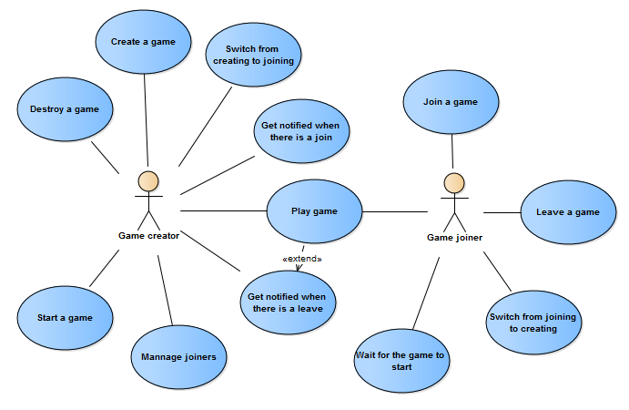
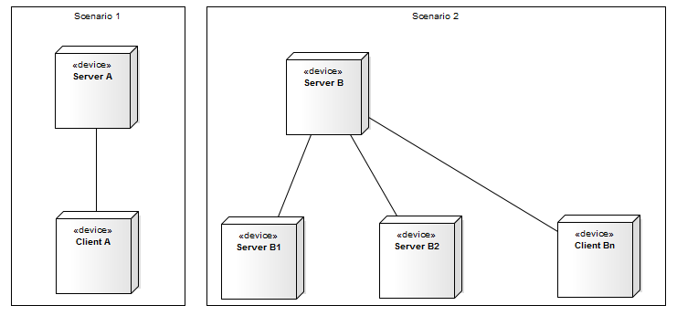
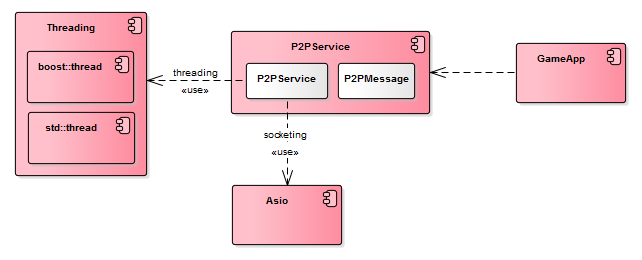
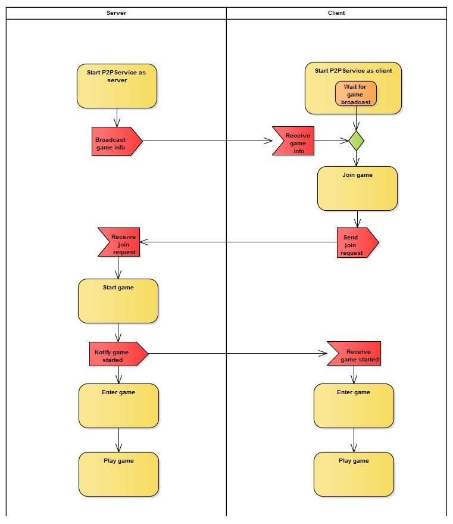
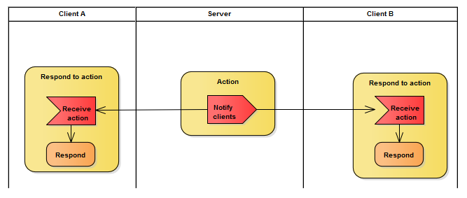
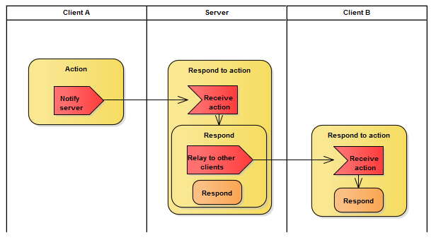
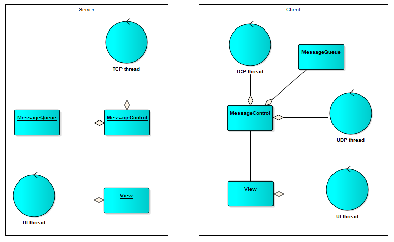

# Scenario
General requirement from a game developer’s view
There is a need to develop LAN based peer-to-peer (p2p) games. A library is needed to support the development of p2p games. Games will run on Android devices and Linux devices. For some Linux devices, customized compiler is developed and they may not support C++11.
There is no center server.
Different games could be supported, such as chess, blackjack, action games, role play etc.
Use case
There a 2 different roles when one player tries to play a p2p game with another player or other players. One (creator) needs to create a game and then others (joiner) can join the game. Typical use cases of certain p2p game are illustrated as bellow. Most of the expectations of the 2 roles differ, but some of them overlap.

Game joiner may not need to needed to be notified when waiting for a game to start.
# Requirement added from a library developer’s view
1. C++ 
2. Minimum dependency
3. Concise API
4. Basic

# Design

## Deployment

## Components

The p2p library is represented by P2PService. It’s built on socketing provided by asio and threading provided by std or boost. Whether to use std or boost is determined at compile time -- use std unless the compiler doesn’t support c++11.
The data protocol is represented by P2PMessage. Although there are third party data protocols such as google protobuf and marshal, it’s better here to create the wheel. The most important reason is to keep minimal dependency. Also, only basic messaging is needed, which include denoting, encoding and decoding.
GameApp only depends on the P2PService component.
## Workflows
### Game setup

### Action at server

### Action at client

## Threading

Both server and client have one UI thread for interacting with player and one TCP thread for sending and receiving game data. Client has one UDP thread for receiving game information before game start. Server doesn’t have such need. The receiving of game information broadcast is blocking, but the broadcasting is non-blocking.
## Interface design

# Usage
Generally, when developing a p2p game, one needs to do the following work to have the p2p mechanism going:
- Implement and manage different message types and message IDs.
- Implement and register callbacks to message ID
- Call P2PService’s API to update game state
# Issue
This is only a simple implementation of a p2p game toolkit. As they say, keep it simple. How ever, there may be some improvements worth mentioning.
- When the game creator exits the game, the other players are also forced to exit the game. This cannot be resolved easily without a center server.
- Messages need to be synchronized among all playing players. Currently, when server is suspended (for example, when the game goes to background), the message relay is suspended (the reason is that the game process is suspended); when client is suspended, other players can continue playing, and when the suspension is resumed, all the messages in the queue are handled one after another without delay. There may be two refinements on this:
   - Keep the message relay running even when the server is in the background. A new service process may be included so as to run in the background. A service is platform dependent. For example, android and Linux implementation of service is different.
   - Notify others when one player is suspending a game. For games played on mobile devices, since the notification may take some time and the suspension is almost instant, this is also a need for new service process.
# Applications
3 games are developed and published based on this library. 
- Chess: A 2-players game with one against the other. Regretting, surrendering, draw requesting, and confirmation are supported.
- Landlord poker game: A popular gamble game of 3 players with 2 against 1. 
- Bomber: A role play strategy and action game with 2, 3, or 4 players against each other. When one player’s role dies, the player can stay in the game to watch others playing, or exit the game and others can continue playing with each other.