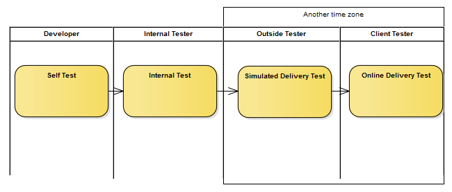
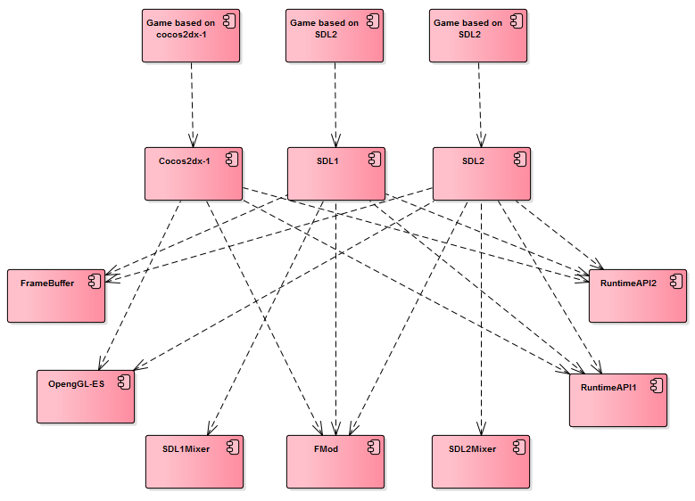
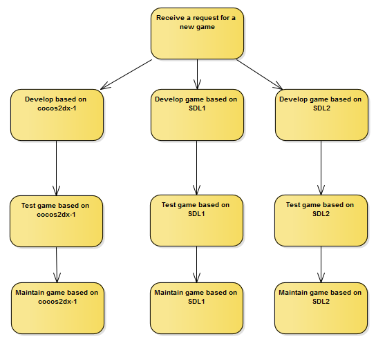
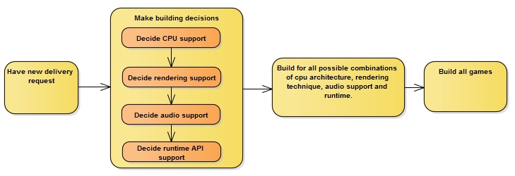
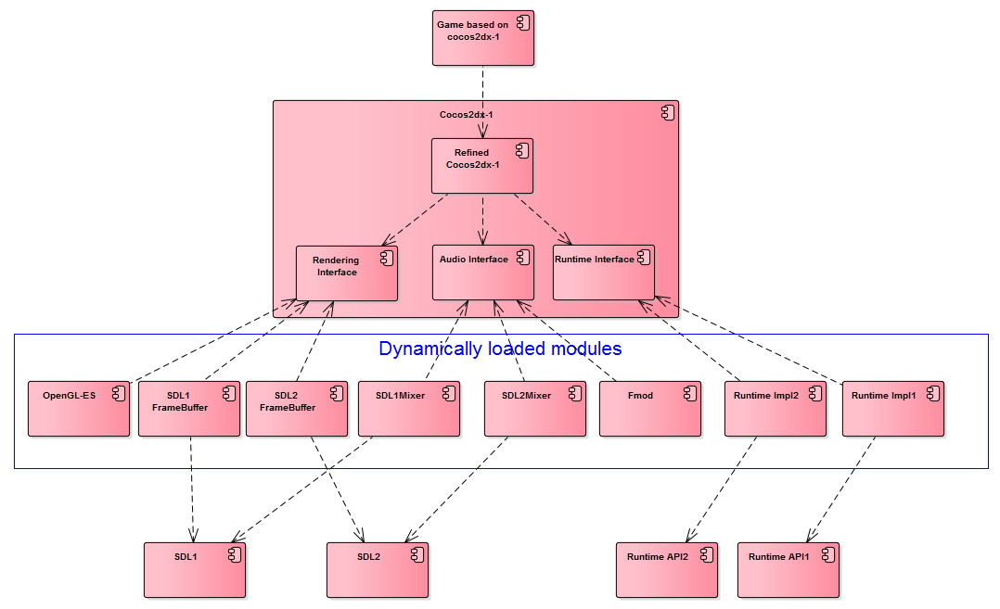
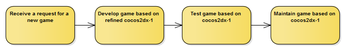
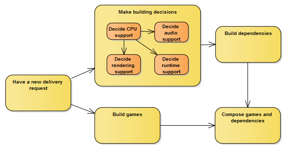
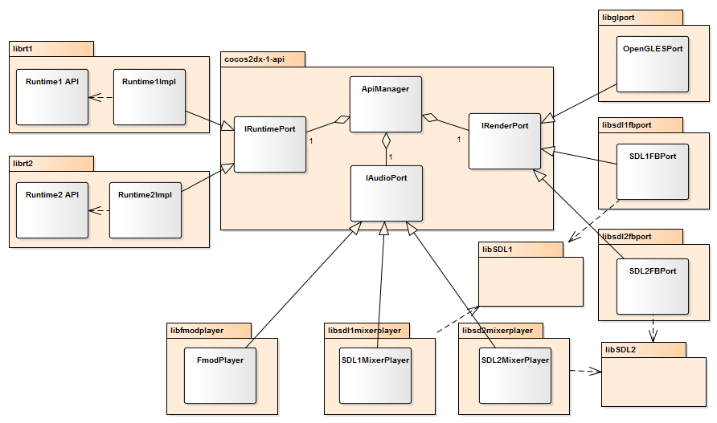
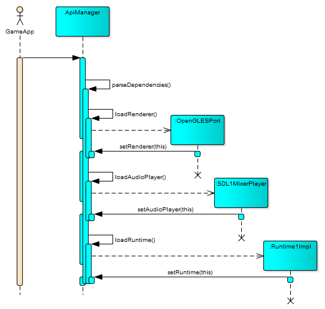

## Problem
Games need to be published to different Linux seatback devices. The devices may differ in the following aspects:
- Audio support: Audio playback can be based on SDLmixer, SDL2Mixer or fmod. 
- Rendering support: Rendering can be based on OpenGL-ES, SDL1 frame buffer, SDL2 frame buffer.
- Game runtime management: The game needs to implement certain APIs so as to respond to events, such as pause, resume, prompting announcements. On some devices, there are special button to be responded. The APIs are under continuous development. Some APIs may need to be supported when there is a delivery request.
- CPU architecture: arm and x86 can be supported.

The test of games needs to be very efficient, which is illustrated bellow.

The test of games has 4 steps. Self test and internal test results can be updated to game developer instantly, but simulated delivery test and online delivery test results have a delay of 11 hours to be updated to the developer. Online delivery test has only 1 or 2 tries. If certain game doesn’t pass on the second test, it misses a chance to be delivered. Many months later there may be another chance. With each delivery, several games need to be delivered. If one of them doesn’t pass the test, then none of the games can be delivered. Simulated delivery test and online delivery test have very tight schedule, which is typically one week. Simulated delivery test cannot be done in advance because the environment is in continuous development too. When the environment is released, there is not much time left for game developer to catch up with the final delivery schedule.
### Legacy game development
Upon request of a new game, different copies of games are developed on different game engines. Currently, game engines needing support are cocos2dx-1, SDL1 and SDL2. More engines may be added in the future.

#### Legacy game components and dependencies

#### Legacy game development procedure

#### Problems of legacy game development procedure
- It’s inefficient and boring to work on one game for several times.
- The effort to maintain a game is painful and time consuming. For example, if a bug is found in one version of the game, it needs to be fixed for all versions.
- It severely violates the “Donot Repeat Yourself (DRY)” idiom which is a well-known practice of programming.
- The extension is poor. It takes much effort to support another game engine.
- The delivery process is inefficient and time consuming and error prone.

### Legacy delivery procedure
The delivery procedure can be illustrated as bellow.

The building of games depends on the building of all possible combinations of CPU architecture, rendering technique, audio support and runtime API. These are all sequentially dependent. Therefore, at most there can be 2(CPU architectures) * 3(audio) * 3(rendering) * 4(runtime API) = 48 builds of game dependencies, as illustrated bellow.
| CPU arch |	Audio	| Rendering	| Runtime |	Total |
| :---: | :---: | :---: | :---: | :---: |
|2	| 3	| 3	| 4 | 	2x3x3x4=48|
Although in practice, the number would be 2 or 4 or 8. Typically, the building of one type of dependency takes about an hour. To make delivery clean, each release of games will require a clean build of the dependencies and games.

The problems are:
- The building process is too time consuming.
- One error in certain step may require some change to code, which will take a lot of time to rebuild all dependencies.

## Solution
The components are refactored to the following structure. Most of the implementations are put to separate dynamically loaded modules, as illustrated bellow.

### Refined game development
Only one copy of game code is developed based on refined cocos2dx-1.

### Refined delivery procedure

In the refined delivery procedure illustrated above, the building of games doesn’t depend on building of dependencies. Also, there is no sequential dependence among the rendering support, audio support and runtime support. The game dependencies and games are composed so as to run in the release step.

## Realization

### Classes
Cocos2dx-1 engine is refined to support APIs. Three API interfaces are added, namely IRuntimePort, IRenderPort and IAudioPort. Also, a singleton ApiMananer is added to manage the implementations of the interfaces. Each implementation is built to a dynamically loaded library.

### Sequences

### Loading of modules

## Analysis of the refinement
### Improvement
1. The game development and maintenance is highly improved. Currently, 3 engines are supported, so the refined is 3 times more efficient than the legacy method.
2. The building procedure is more efficient and more robust. If there is a bug in certain module, only that module has to be rebuilt. The refined building time of a delivery is about an hour.
3. The test is more efficient. Since the game dependencies are dynamically decided, with modifiable configuration, the tester can test with different configurations without having to build another binary.
4. Support of new requirement is much easier. Just add a new module.
### Issues
Having delivered successfully over 5 times, no issue is found up till now.

